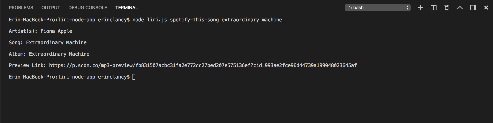
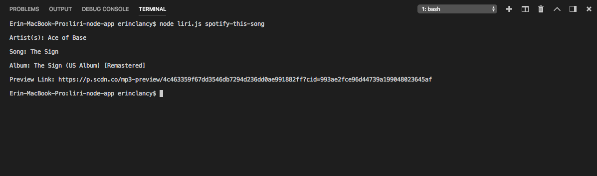
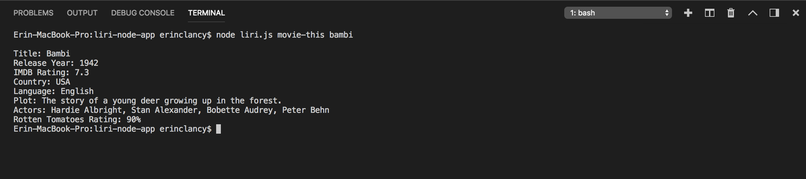
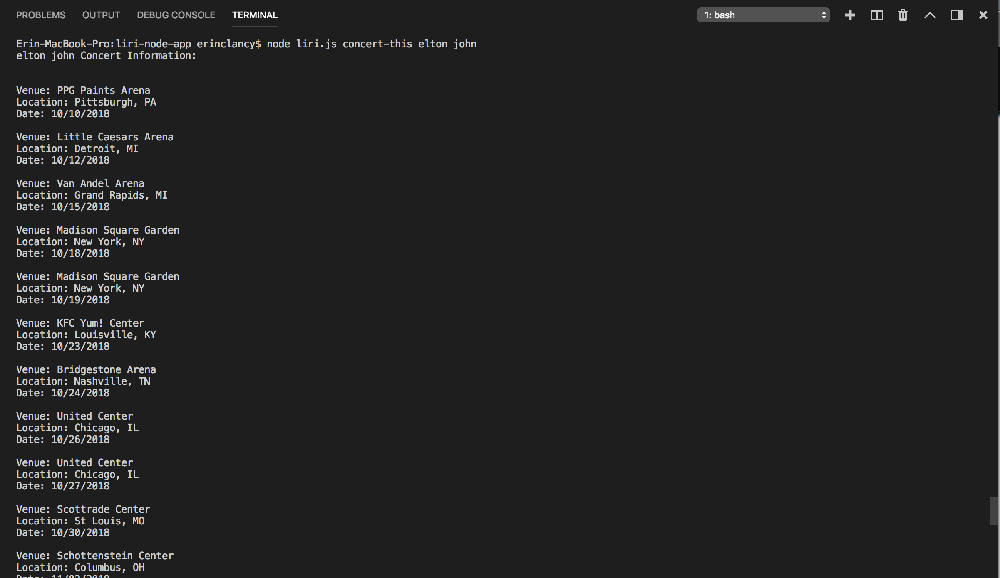
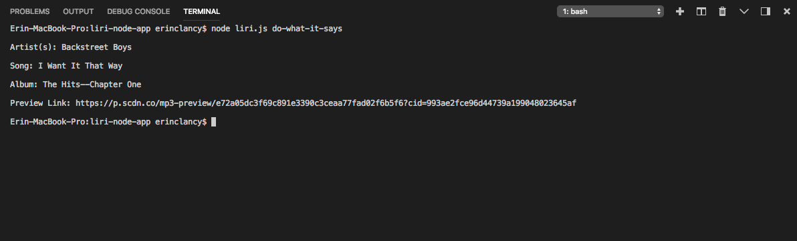

# Liri Node App
LIRI(Language Interpretation and Recognition Interface): Searches Spotify for songs, Bands in Town for concerts, OMDB for movies.

LIRI can take in the following request types:

   * concert-this
   * spotify-this-song
   * movie-this
   * do-what-it-says

*NOTE: Must have 'node liri.js' in the command line before entering Request* 

## SPOTIFY

Searches the Spotify API when:

Request: 'spotify-this-song'

    e.g. node liri.js spotify-this-song '<song name here>'

Response:  

   * Artist(s)
   * The song's name
   * A preview link of the song from Spotify
   * The album that the song is from

Screenshot:

IF NO USER INPUT:

## OMDB

Searches the OMDB API when:

Request: 'movie-this'

    e.g. node liri.js movie-this '<movie title here>'

Response:

   * Title of the movie.
   * Year the movie came out.
   * IMDB Rating of the movie.
   * Rotten Tomatoes Rating of the movie.
   * Country where the movie was produced.
   * Language of the movie.
   * Plot of the movie.
   * Actors in the movie.

Screenshot:

IF NO USER INPUT:

## BANDS IN TOWN 

Searches the Bands in Town Artist Events API when:

Request: 'concert-this' 

    e.g. node liri.js concert-this '<band/artist name here>'

Response: 

   * Name of the venue
   * Venue location
   * Date of the Event (use moment to format this as "MM/DD/YYYY")

Screenshot:

## DO WHAT IT SAYS

Using the fs Node package, pulls text from the random.txt file and uses the data to search Spotify for "I want it that way"

Request: 'do-what-it-says'

    e.g. node liri.js do-what-it-says

Response: 

   * Artist(s): Backstreet Boys
   * Song: I Want It That Way
   * Album: The Hits--Chapter One
   * Preview Link: https://p.scdn.co/mp3-preview/e72a05dc3f69c891e3390c3ceaa77fad02f6b5f6?cid=993ae2fce96d44739a199048023645af

Screenshot:

