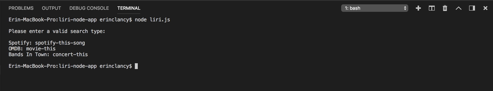

# liri-node-app
LIRI: Search Spotify for songs, Bands in Town for concerts, OMDB for movies

Must have 'node liri.js' in the command line before entering Request 

**SPOTIFY**
Searches the Spotify API when: 

Request: 'spotify-this-song'

Response:  

   * Artist(s)
   * The song's name
   * A preview link of the song from Spotify
   * The album that the song is from

Screenshot:

IF NO USER INPUT:

**OMBD**
Searches the OMDB API when:

Request: 'movie-this'

Response:

   * Title of the movie.
   * Year the movie came out.
   * IMDB Rating of the movie.
   * Rotten Tomatoes Rating of the movie.
   * Country where the movie was produced.
   * Language of the movie.
   * Plot of the movie.
   * Actors in the movie.

Screenshot:

IF NO USER INPUT:

**BANDS IN TOWN** 

Searches the Bands in Town Artist Events API when:

Request: 'concert-this' 

Response: 

   * Name of the venue
   * Venue location
   * Date of the Event (use moment to format this as "MM/DD/YYYY")

Screenshot:

**DO WHAT IT SAYS**

Using the fs Node package, pulls text from the random.txt file and uses the data to search Spotify for "I want it that way"

Request: 'do-what-it-says'

Response: 

   * Artist(s): Backstreet Boys
   * Song: I Want It That Way
   * Album: The Hits--Chapter One
   * Preview Link: https://p.scdn.co/mp3-preview/e72a05dc3f69c891e3390c3ceaa77fad02f6b5f6?cid=993ae2fce96d44739a199048023645af

Screenshot:

**NO "type" ENTRY**

Using the fs Node package, pulls text from the random.txt file and uses the data to search Spotify for "I want it that way"

Request: search type left blank

Response: 

    Please enter a valid search type:

    Spotify: spotify-this-song
    OMDB: movie-this
    Bands In Town: concert-this

Screenshot:

